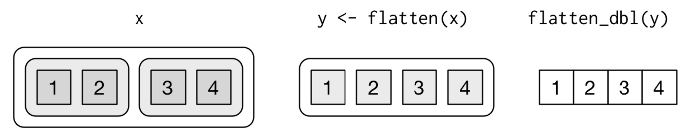
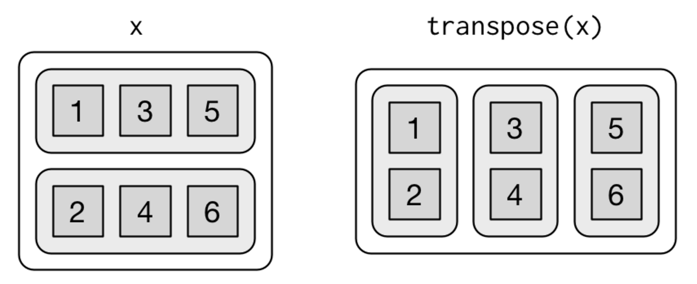

```{r setup, include=FALSE}
knitr::opts_chunk$set(echo = TRUE)
library(dplyr)
library(purrr)
```

```{r, echo = FALSE}
set.seed(1994)
df <- matrix(rnorm(25), 5) %>% data.frame %>% setNames(letters[1:5])
```

All the map functions in `purrr` take an interable object `.x` as their first argument.  They then apply `.f` to each elemenet of `.x`.  The type of object returned depends on the suffix (the part after `_`)

Function     | Returns
------------ | --------------------
`map()`      | list or data frame
`map_lgl`    | logical vector
`map_int`    | integer vector
`map_dbl`    | double vector
`map_chr`    | character vector
`map_df`     | data frame

A few things to note:

* `map()` is identical to `lapply()`.  There are no computational advantages to using one over the other.  The only difference is that `map()` is consistent  with the other `map_*()` functions
* `sapply` automatically tries to simplify results, which is nice when you are exploring your data manually, but bad in scripts because it isn't consistent

```{r}
x1 <- list(
  c(0.27, 0.37, 0.57, 0.91, 0.20),
  c(0.90, 0.94, 0.66, 0.63, 0.06), 
  c(0.21, 0.18, 0.69, 0.38, 0.77)
)

x1 <- as.data.frame(x1) %>% setNames(letters[1:3])
x2 <- list(
  c(0.50, 0.72, 0.99, 0.38, 0.78), 
  c(0.93, 0.21, 0.65, 0.13, 0.27), 
  c(0.39, 0.01, 0.38, 0.87, 0.34)
)

threshold <- function(x, cutoff = 0.8) x[x > cutoff]
x1 %>% sapply(threshold) %>% str
x2 %>% sapply(threshold) %>% str
```

* `vapply()` is safer than `sapply()` to use since you always specify the data type you want it to output.  It has the disadvantage of being verbose.

```{r}
x1 %>% vapply(mean, numeric(1))
x1 %>% map_dbl(mean)
```


### Your Turn

Use map_dbl() to find column means
```{r}
x1_mean <- map_dbl(x1,mean)
```

Use map_dbl() to column medians
```{r}
x1_median <- map_dbl(x1,median)
```

Use map_dbl() to find column standard deviations
```{r}
x1_sd <- map_dbl(x1,sd)
```


## Passing other arguments

Notice that the `map_*` functions have `...` like `lapply()`.  This allows you to additional arguments to the function `.f`.  For example, if you wanted to calculate a truncated mean by specifying the `trim` argument inside the `mean()` function:

```{r}
x1 %>% map_dbl(mean, trim = 0.25)
```

### Your turn

```{r}
planes <- nycflights13::planes
```

Find the column means of planes using `map_dbl`, ignoring NAs.  Notice that `map` safely ignores columns where the mean doesn't make sense.
```{r}
a= planes %>% map_dbl(mean, na.rm = TRUE)
```

Similarly, find the 5th percentile of each column using `quantile()`.
```{r}
planes[, c(2,8)] %>% map_dbl(quantile, probs = 0.05, na.rm = TRUE)

```

## Choosing the right `map_*()` function.

While you can always use `map()` to return a list, it's always a good idea to think about the data type you actually want a script to return.  The `map_*()` functions are __type consistent__, meaning they will always return the specified data type, a warning saying not all elements returned the specified type, or an error if all elements failed to return the specified type.  In the example below, `map_lgl()` returns an error since none of the outputs were logical values.

```{r, error = TRUE}
set.seed(2000)
df <- data.frame(a = rnorm(5), b = sample(c("A", "B"), 5, T), c = 1:5, stringsAsFactors = F)
df %>% map_lgl(mean)
```

### Your turn

Choose the appropriate map function to perform the following tasks on `df`:

Finding out which columns are numeric with `is.numeric()`.
```{r}
df %>% map_lgl(is.numeric)
```

Finding out the column types of each column using `typeof`.
```{r}
df %>% map_chr(typeof)
```

Finding a summary of each column with `summary`
```{r}
df %>% map(summary)
```

## Anonymous functions

Just like with `lapply()`, you can use anonymous functions inside `map_*` when you don't want to explicitly create a function.

```{r}
df %>% map(function(x) sum(is.na(x)))
```

Anonymous functions in `R` tend to be a little verbose, so `purrr` has a shortcut available for use.  Using a `.` or `.x` to denote an element of `.x`, we can write a __formula__ that does the same thing as an anonymous function in the following ways:

```{r}
df %>% map(~ sum(is.na(.)))
```

```{r}
df %>% map(~ .x %>% is.na %>% sum)
```

## Subsetting

One of the most common operations that gets anonymized is subsetting (with `[[]]`).  For example:
```{r}
my_list <- list(
  list(a = 1, b = "a"),
  list(a = 2, b = "b"),
  list(a = 3, b = "c")
)

my_list %>% map_dbl(function(x) x[["a"]])
```

The shortcut for subsetting is to either call on the desired element by name or position:
```{r}
my_list %>% map_dbl("a")
my_list %>% map_dbl(1)
```

### Your turn

This code subsets the `mtcars` data set into 4, 6, and 8 cylinder engine cars and then performs a linear regression ("finds a line of best fit") of `mpg` on `wt` with each of the subsets.  The results are saved in `models`.
```{r}
models <- mtcars %>% split(mtcars$cyl) %>% map(~ lm(mpg ~ wt, data = .x))
```

The `coef()` function extracts the coefficients from a model.  Use it in conjunction with `map()` to extract the coefficients of each model.  Save the results in `coefficients`

```{r}
coefficients <- map(models, coef)
```

Using the string shortcut for subsetting, extract the `wt` coefficient of each model.
```{r}
map_dbl(coefficients,"wt")
```

## Nested Structures

You can extract deeply nested elements of a list using character vectors.  A common example of when this might occur is when working with JSON data.  Take for example, these issues taken from the GitHub API:
```{r, eval = F}
issues <- jsonlite::fromJSON("issues.json", simplifyVector = FALSE)
```

Examining the data reveals that there are 8 issues, each in a nested list
```{r, eval = F}
length(issues)
str(issues)
```

You could extract the user login and id by traveling down the tree in two steps, first through user and then accessing login and id.
```{r, eval= F}
users <- issues %>% map("user")
users %>% map_chr("login")
users %>% map_int("id")
```

However, you could also traverse the tree in a single step, by specifying a character vector:
```{r, eval = F}
issues %>% map_chr(c("user", "login"))
issues %>% map_int(c("user", "id"))
```

## Removing a level of the hierarchy

Sometimes you want to remove a level of your tree altogether, collecting all the children in one list.  The `flatten_*()` functions in `purrr` take care of this.  Like with map, they are typed, so you have `flatten()`, `flatten_lgl()`, `flatten_int()`, `flatten_dbl()`, and `flatten_chr()`.  In the code below, we flatten a list of lists of double vectors into a list of double vectors, and then to a vector.
```{r}
x <- list(list(a = 1, b = 2), list(c = 3, d = 4))
str(x)
y <- flatten(x) 
str(y)
flatten_dbl(y)
```

Visually, this is what's happening:


## Transposing
Sometimes the tree feels a little "inside-out". You can use `transpose()` to flip the first and second levels of a list:

```{r}
x <- list(
  x = list(a = 1, b = 3, c = 5),
  y = list(a = 2, b = 4, c = 6)
)
x %>% str()
x %>% transpose() %>% str()
```

Visually, this is what we have:


Transposing is very useful when working with JSON APIs since many JSON data sources represent their data in a row-based format whereas R is more naturally a column-based format.